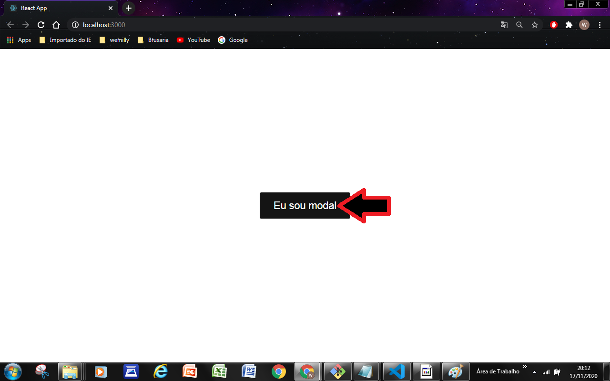
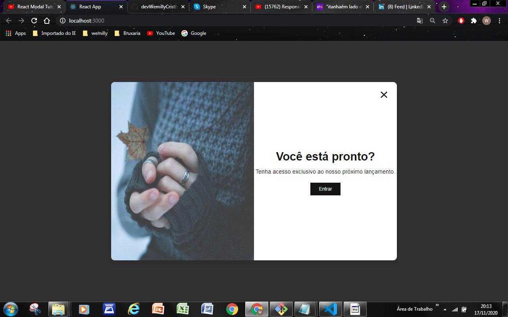

# Modal

### Responsivos com CSS Grid | CSS Html
### Este projeto tem como objetivo criar habiliadades com componentização e CSS




### _Para você conseguir fazer esse projeto, você precisa instalar as seguintes dependências:_

``` 
npm install react-icons --save 
 
yarn add styled-components
 
yarn add react-spring@next

```
Este projeto foi feito em:

<ul>
   <li><a href="https://developer.mozilla.org/pt-BR/docs/Web/HTML">HTML5</a></li>
    <li><a href="https://developer.mozilla.org/pt-BR/docs/Web/CSS">CSS3</a></li>
    <li><a href="https://developer.mozilla.org/pt-BR/docs/Web/CSS/CSS_Flexible_Box_Layout/Conceitos_Basicos_do_Flexbox">FlexBox</a></li>
    <li><a href="https://pt-br.reactjs.org/">React.js</a></li>
</ul>


_Espero que tenha gostado deste projeto e sinte-se avontade para contibuir.
Caso queira entrar em contato segue abaixo minhas redes sociais._<br><br>
 ## 📫 Contatos <br><br>

 [](https://medium.com/@devwemilly.frontend)  [](https://www.linkedin.com/in/devwemilly-cristhiny-7674041b7/)